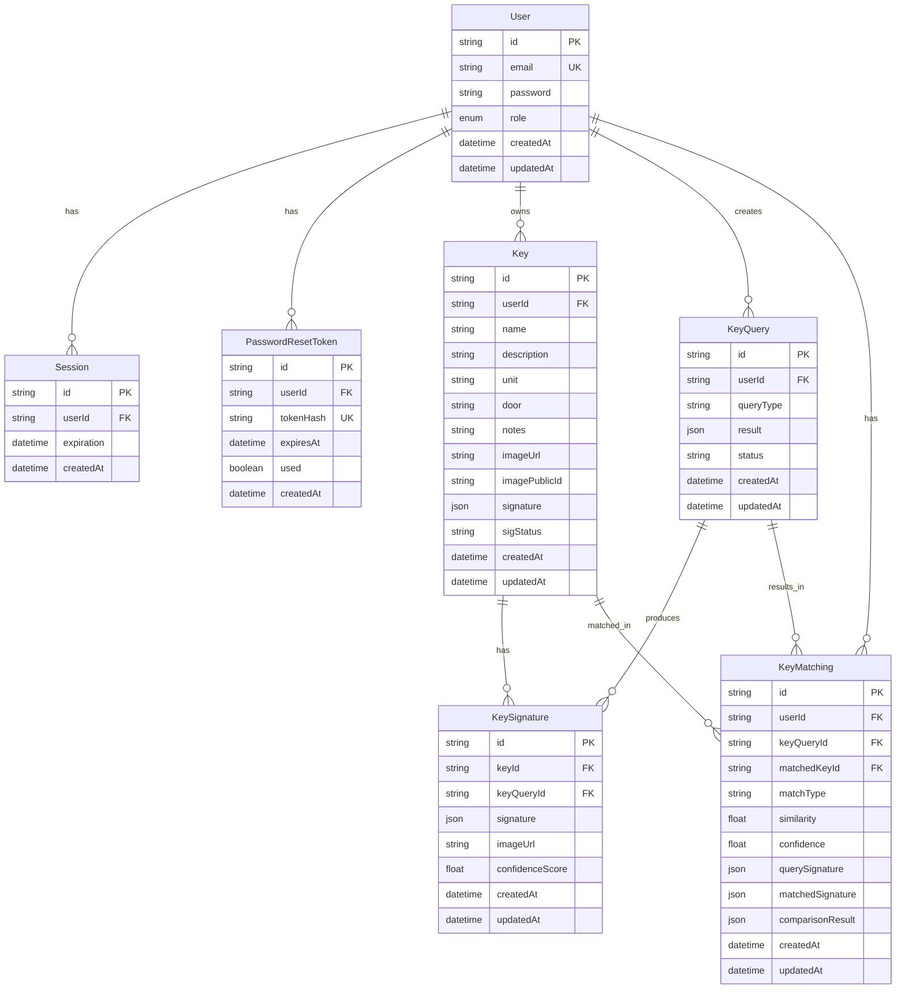
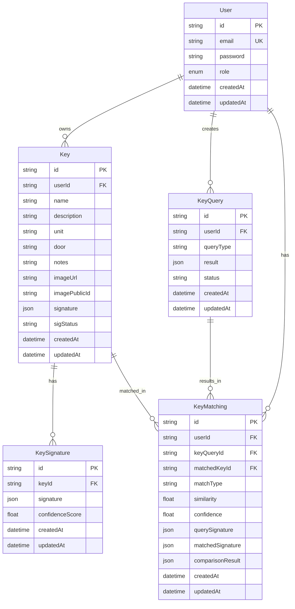

# 🔬 Análisis Profundo: Base de Datos, Heroku y Uso Real en Staging

## 📋 Resumen Ejecutivo

Este documento proporciona un análisis exhaustivo del uso real de la base de datos, configuración de Heroku y código activo en staging para identificar con precisión qué se utiliza y qué puede eliminarse de forma segura.

**Fecha de análisis**: $(date)  
**Versión analizada**: Main branch (staging actual)  
**Modelo activo**: V6 "Hybrid Balanced" (GPT-4o multimodal AI)

---

## 🗄️ **1. ESQUEMA DE BASE DE DATOS**

### **1.1. ERD Actual (Esquema Completo)**



### **1.2. ERD Mínimo (Solo V6 Activo)**



**Nota**: `Session` y `PasswordResetToken` se mantienen para autenticación, pero no forman parte del flujo de escaneo V6.

---

## 📊 **2. MATRIZ DE USO READ/WRITE POR TABLA**

### **2.1. Modelo `User`**

| Operación | Ruta/Módulo | Campos Usados | Evidencia |
|-----------|-------------|---------------|-----------|
| **CREATE** | `app/utils/auth.server.js` - `createUser()` | `email`, `password`, `role` (default) | ✅ Usado en signup |
| **READ** | `app/utils/auth.server.js` - `getUserByEmail()` | `email`, `password` | ✅ Usado en signin |
| **READ** | `app/utils/auth.server.js` - `getUserById()` | `id`, `email` | ✅ Usado para verificación |
| **READ** | `app/utils/session.server.js` - `requireUserId()` | `id` (implícito) | ✅ Usado en todas las rutas |
| **UPDATE** | `app/utils/auth.server.js` - `resetPassword()` | `password` | ✅ Usado en reset-password |

**Campos activos en V6**: `id`, `email`, `password`, `role`, `createdAt`, `updatedAt`  
**Campos no usados en V6**: Ninguno (todos son necesarios para autenticación)

**Relaciones usadas**:
- ✅ `keys` - Para obtener inventario de llaves
- ✅ `keyQueries` - Para queries de escaneo
- ✅ `matchings` - Para resultados de matching
- ❌ `sessions` - Usado por sistema de sesiones (no V6)
- ❌ `passwordResetTokens` - Usado por reset password (no V6)

---

### **2.2. Modelo `Key`**

| Operación | Ruta/Módulo | Campos Usados | Evidencia |
|-----------|-------------|---------------|-----------|
| **CREATE** | `app/lib/keys.server.js` - `createKey()` | `userId`, `name`, `description`, `unit`, `door`, `notes`, `imageUrl`, `imagePublicId`, `signature`, `sigStatus` | ✅ Usado en creación de llave |
| **READ** | `app/lib/keys.server.js` - `getUserKeys()` | `id`, `userId`, `name`, `description`, `createdAt`, `sigStatus` | ✅ Usado en lista de llaves |
| **READ** | `app/lib/keys.server.js` - `getKeyById()` | Todos los campos | ✅ Usado en detalles de llave |
| **READ** | `app/routes/scan_.check.jsx` - Inventario | `id`, `sigStatus` | ✅ Usado para matching V6 |
| **READ** | `app/lib/keys.server.js` - `getRecentKeys()` | `id`, `name`, `description`, `imageUrl`, `createdAt` | ✅ Usado en componente RecentKeys |
| **READ** | `app/lib/keys.server.js` - `getKeyStats()` | `userId`, `sigStatus` | ✅ Usado para estadísticas |
| **UPDATE** | `app/lib/keys.server.js` - `updateKey()` | `name`, `description`, `unit`, `door`, `notes`, `imageUrl`, `imagePublicId`, `updatedAt` | ✅ Usado en edición |
| **UPDATE** | `app/lib/keys.server.js` - `updateKeySignature()` | `sigStatus`, `signature` | ⚠️ Función existe pero no se usa en V6 |
| **DELETE** | `app/lib/keys.server.js` - `deleteKey()` | `id`, `userId` | ✅ Usado en eliminación |

**Campos activos en V6**:
- ✅ `id` - Identificador
- ✅ `userId` - Relación con usuario
- ✅ `name` - Nombre de la llave
- ✅ `description` - Descripción (property)
- ✅ `unit` - Unidad (opcional)
- ✅ `door` - Puerta (opcional)
- ✅ `notes` - Notas (opcional)
- ✅ `imageUrl` - URL de imagen en Cloudinary
- ✅ `imagePublicId` - Public ID de Cloudinary
- ✅ `signature` - **Signature V6 JSON** (guardado en Key por compatibilidad)
- ✅ `sigStatus` - Estado: `"pending"`, `"ready"`, `"failed"` (usado para filtrar inventario)
- ✅ `createdAt` - Ordenamiento
- ✅ `updatedAt` - Tracking

**Campos no usados en V6**: Ninguno - todos los campos son utilizados

**Índices necesarios**:
- ✅ `userId` (FK index automático)
- ✅ `sigStatus` (usado en WHERE para inventario) - **Recomendado: índice compuesto `(userId, sigStatus)`**
- ✅ `createdAt` (usado en ORDER BY)

**Relaciones usadas**:
- ✅ `signatures` - Para obtener KeySignature más reciente en matching
- ✅ `matchings` - Para resultados de matching
- ✅ `user` - Relación con usuario

---

### **2.3. Modelo `KeySignature`**

| Operación | Ruta/Módulo | Campos Usados | Evidencia |
|-----------|-------------|---------------|-----------|
| **CREATE** | `app/lib/keys.server.js` - `createKey()` | `keyId`, `signature`, `imageUrl`, `confidenceScore` | ✅ Creado al crear llave |
| **READ** | `app/routes/scan_.check.jsx` - Inventario | `keyId`, `signature`, `createdAt` | ✅ **Usado para matching V6** |
| **READ** | `app/lib/matching.server.js` - `getMatchingById()` | `id`, `signature` (via relación) | ⚠️ Solo para debugging |

**Campos activos en V6**:
- ✅ `id` - Identificador
- ✅ `keyId` - Relación con Key (usado en WHERE)
- ✅ `signature` - **JSON signature V6** (usado en matching)
- ✅ `confidenceScore` - Puntuación de confianza
- ✅ `createdAt` - Ordenamiento (ORDER BY desc para obtener más reciente)
- ⚠️ `keyQueryId` - **NO se usa en V6** (solo en legacy V5)
- ⚠️ `imageUrl` - Guardado pero no se usa en matching
- ✅ `updatedAt` - Tracking

**Campos no usados en V6**:
- ❌ `keyQueryId` - Solo usado en V5 legacy (puede ser nullable sin problema)

**Índices necesarios**:
- ✅ `keyId` (FK index automático)
- ✅ `createdAt` (usado en ORDER BY) - **Recomendado: índice compuesto `(keyId, createdAt DESC)`**

**Relaciones usadas**:
- ✅ `key` - Para obtener signature de una llave
- ❌ `keyQuery` - **NO se usa en V6**

---

### **2.4. Modelo `KeyQuery`**

| Operación | Ruta/Módulo | Campos Usados | Evidencia |
|-----------|-------------|---------------|-----------|
| **CREATE** | `app/lib/keyscan.server.js` - `processKeyImageV6()` | `userId`, `queryType: "scan"`, `result: { signature, timestamp }`, `status: "completed"` | ✅ **Usado en V6** |
| **READ** | `app/lib/matching.server.js` - `getMatchingById()` | `id`, `queryType`, `createdAt` (via relación) | ⚠️ Solo para debugging |
| **READ** | `app/routes/scan_.analysis.jsx` | `id`, `result` (via KeyMatching) | ⚠️ Solo para análisis visual |

**Campos activos en V6**:
- ✅ `id` - Identificador (usado en KeyMatching)
- ✅ `userId` - Relación con usuario
- ✅ `queryType` - **"scan"** (usado en V6)
- ✅ `result` - JSON con `{ signature, timestamp }`
- ✅ `status` - **"completed"** (usado en V6)
- ✅ `createdAt` - Tracking
- ✅ `updatedAt` - Tracking

**Campos no usados en V6**: Ninguno crítico

**Índices necesarios**:
- ✅ `userId` (FK index automático)
- ✅ `createdAt` (usado en ORDER BY para debugging)

**Relaciones usadas**:
- ✅ `matchings` - Para vincular resultados de matching
- ⚠️ `signatures` - **NO se usa en V6** (solo en V5 legacy)

---

### **2.5. Modelo `KeyMatching`**

| Operación | Ruta/Módulo | Campos Usados | Evidencia |
|-----------|-------------|---------------|-----------|
| **CREATE** | `app/lib/matching.server.js` - `saveMatchingResult()` | Todos los campos | ✅ **Usado en V6** |
| **READ** | `app/routes/scan_.match_yes.jsx` | `id`, `matchedKeyId`, `similarity`, `confidence` | ✅ Usado para mostrar match |
| **READ** | `app/routes/scan_.possible.jsx` | `id`, `matchedKeyId`, `similarity`, `confidence` | ✅ Usado para mostrar posibles matches |
| **READ** | `app/routes/scan_.analysis.jsx` | `id`, `result`, `matchType`, `similarity` | ✅ Usado para análisis visual |
| **READ** | `app/lib/matching.server.js` - `getUserMatchings()` | Todos los campos | ⚠️ Función existe pero no se usa en rutas |
| **READ** | `app/lib/matching.server.js` - `getMatchingStats()` | `matchType`, `userId` | ⚠️ Función existe pero no se usa en rutas |
| **READ** | `app/lib/matching.server.js` - `getMatchingById()` | Todos los campos | ⚠️ Función existe pero no se usa en rutas |

**Campos activos en V6**:
- ✅ `id` - Identificador
- ✅ `userId` - Relación con usuario
- ✅ `keyQueryId` - Relación con KeyQuery
- ✅ `matchedKeyId` - Key que hizo match (nullable si NO_MATCH)
- ✅ `matchType` - **"MATCH_FOUND"**, **"POSSIBLE_KEYS"**, **"NO_MATCH"**
- ✅ `similarity` - Similarity score (0-1)
- ✅ `confidence` - Confidence score (0-1)
- ✅ `querySignature` - **JSON signature V6 de la llave escaneada**
- ✅ `matchedSignature` - **JSON signature V6 de la llave matcheada** (nullable)
- ✅ `comparisonResult` - JSON con detalles de comparación
- ✅ `createdAt` - Ordenamiento (ORDER BY desc)
- ✅ `updatedAt` - Tracking

**Campos no usados en V6**: Ninguno

**Índices necesarios**:
- ✅ `userId` (FK index automático)
- ✅ `keyQueryId` (FK index automático)
- ✅ `matchedKeyId` (FK index automático)
- ✅ `createdAt` (usado en ORDER BY) - **Recomendado: índice compuesto `(userId, createdAt DESC)`**
- ✅ `matchType` (usado en WHERE para stats) - **Recomendado: índice compuesto `(userId, matchType)`**

**Relaciones usadas**:
- ✅ `user` - Relación con usuario
- ✅ `keyQuery` - Relación con query
- ✅ `matchedKey` - Relación con llave matcheada

---

### **2.6. Modelo `Session`**

| Operación | Ruta/Módulo | Campos Usados | Evidencia |
|-----------|-------------|---------------|-----------|
| **CREATE** | `app/utils/session.server.js` - `createUserSession()` | `userId`, `expiration` | ✅ Usado en autenticación |
| **READ** | `app/utils/session.server.js` - `getUser()` | `id`, `userId`, `expiration` | ✅ Usado en verificación de sesión |
| **DELETE** | `app/utils/session.server.js` - `logout()` | `userId` | ✅ Usado en logout |

**Campos activos**: Todos (sistema de autenticación)  
**Uso en V6**: No directamente, pero necesario para autenticación

---

### **2.7. Modelo `PasswordResetToken`**

| Operación | Ruta/Módulo | Campos Usados | Evidencia |
|-----------|-------------|---------------|-----------|
| **CREATE** | `app/utils/auth.server.js` - `createPasswordResetToken()` | `userId`, `tokenHash`, `expiresAt` | ✅ Usado en forgot-password |
| **READ** | `app/utils/auth.server.js` - `verifyPasswordResetToken()` | `tokenHash`, `expiresAt`, `used` | ✅ Usado en reset-password |
| **DELETE** | `app/utils/auth.server.js` - `deletePasswordResetTokens()` | `userId` | ✅ Usado para limpiar tokens |

**Campos activos**: Todos (sistema de reset password)  
**Uso en V6**: No directamente, pero necesario para funcionalidad de reset

---

## 🔍 **3. ANÁLISIS DE USO REAL POR FLUJO**

### **3.1. Flujo de Escaneo V6 (scan_.check.jsx)**

**Base de Datos - Lecturas**:
1. `getUserKeys(userId)` → `Key.findMany({ where: { userId }, orderBy: { createdAt: 'desc' } })`
   - Campos: `id`, `sigStatus`
   - Filtro: Solo keys con `sigStatus === 'ready'`

2. `KeySignature.findFirst({ where: { keyId }, orderBy: { createdAt: 'desc' } })`
   - Campos: `signature` (JSON)
   - Por cada key con sigStatus ready

**Base de Datos - Escrituras**:
1. `KeyQuery.create()` → En `processKeyImageV6()`
   - Campos: `userId`, `queryType: "scan"`, `result: { signature, timestamp }`, `status: "completed"`

2. `KeyMatching.create()` → En `saveMatchingResult()`
   - Campos: Todos los campos del modelo
   - Solo si hay inventario y hay match

**Procesamiento**:
- `analyzeKeyWithHybridBalancedAI()` → GPT-4o (no BD)
- `compareHybridBalancedKeySignatures()` → Comparación en memoria (no BD)

---

### **3.2. Flujo de Creación de Llave (keys.$id.jsx → createKey)**

**Base de Datos - Escrituras**:
1. `Key.create()` → Con todos los campos
   - `signature` extraído con `extractSignatureV6()` (GPT-4o)
   - `sigStatus` = "ready" si signature exitosa

2. `KeySignature.create()` → Si signature exitosa
   - Campos: `keyId`, `signature`, `confidenceScore`, `imageUrl`

**Procesamiento**:
- `extractSignatureV6()` → GPT-4o (no BD)
- `uploadImageToCloudinary()` → Cloudinary (no BD)

---

### **3.3. Flujo de Visualización de Match (scan_.match_yes.jsx)**

**Base de Datos - Lecturas**:
1. `KeyMatching.findFirst({ where: { userId, matchedKeyId: keyId }, orderBy: { createdAt: 'desc' } })`
   - Campos: `id`, `similarity`, `confidence`, `matchType`

**Base de Datos - No se escriben datos**

---

## 📦 **4. ESTADO DE MIGRACIONES**

### **4.1. Inventario de Migraciones**

**Estado**: No se encontró carpeta `prisma/migrations/` en el repositorio.

**Implicaciones**:
- ⚠️ El proyecto puede estar usando `prisma db push` en lugar de migraciones formales
- ⚠️ No hay historial de cambios de esquema
- ✅ El schema actual está en `prisma/schema.prisma`

**Comandos recomendados para validar**:
```bash
# Verificar estado
npx prisma migrate status

# Validar schema
npx prisma validate

# Formatear schema
npx prisma format

# Ver diferencias con BD
npx prisma db pull
npx prisma migrate diff --from-schema-datamodel prisma/schema.prisma --to-schema-datasource prisma/schema.prisma
```

---

### **4.2. Validación de Schema**

**Modelos Prisma vs Código V6**:

| Modelo | Usado en V6 | Uso Principal |
|--------|-------------|---------------|
| `User` | ✅ Sí | Autenticación |
| `Session` | ⚠️ Indirecto | Autenticación (no V6) |
| `PasswordResetToken` | ⚠️ Indirecto | Reset password (no V6) |
| `Key` | ✅ Sí | **Core V6** |
| `KeySignature` | ✅ Sí | **Core V6** (signatures) |
| `KeyQuery` | ✅ Sí | **Core V6** (queries) |
| `KeyMatching` | ✅ Sí | **Core V6** (results) |

**Todos los modelos son utilizados**, pero algunos solo indirectamente (autenticación).

---

### **4.3. Campos Potencialmente Obsoletos**

**En `KeySignature`**:
- ⚠️ `keyQueryId` - **NO se usa en V6**
  - Solo se usa en V5 legacy (`api.analyze-key.js`)
  - Puede mantenerse nullable para compatibilidad
  - **Recomendación**: Mantener pero marcar como deprecated

**En `KeyQuery`**:
- ⚠️ `signatures` (relación) - **NO se usa en V6**
  - Solo se usa en V5 legacy
  - **Recomendación**: Mantener por compatibilidad

---

## 🚀 **5. CONFIGURACIÓN HEROKU**

### **5.1. Variables de Entorno Requeridas**

**Base de Datos**:
- ✅ `DATABASE_URL` - **REQUERIDO** - Conexión PostgreSQL
- ⚠️ `SHADOW_DATABASE_URL` - Opcional (para migraciones)

**Autenticación**:
- ✅ `SESSION_SECRET` - **REQUERIDO** - Secreto para sesiones
- ✅ `NODE_ENV` - **REQUERIDO** - "production" en staging

**AI (V6)**:
- ✅ `OPENAI_API_KEY` - **REQUERIDO** - API key de OpenAI para GPT-4o

**Cloudinary (Storage)**:
- ✅ `CLOUDINARY_CLOUD_NAME` - **REQUERIDO** (si usa Cloudinary)
- ✅ `CLOUDINARY_API_KEY` - **REQUERIDO** (si usa Cloudinary)
- ✅ `CLOUDINARY_API_SECRET` - **REQUERIDO** (si usa Cloudinary)
- ⚠️ `CLOUDINARY_UPLOAD_PRESET` - Opcional

**Email (Reset Password)**:
- ✅ `RESEND_API_KEY` o `SENDGRID_API_KEY` - Para emails
- ✅ `MAIL_FROM_NAME` - Nombre del remitente
- ✅ `MAIL_FROM_ADDRESS` - Email del remitente
- ✅ `APP_URL` - URL base de la app (para links de reset)

**Computer Vision Legacy (NO USADO EN V6)**:
- ❌ `KEYSCAN_THRESHOLD_MATCH` - **NO USADO** (solo V5 legacy)
- ❌ `KEYSCAN_THRESHOLD_POSSIBLE` - **NO USADO** (solo V5 legacy)
- ❌ `KEYSCAN_THRESHOLD_DELTA` - **NO USADO** (solo V5 legacy)
- ❌ `KEYSCAN_WEIGHT_BITTING` - **NO USADO** (solo V5 legacy)
- ❌ `KEYSCAN_WEIGHT_EDGE` - **NO USADO** (solo V5 legacy)
- ❌ `KEYSCAN_WEIGHT_SHAPE` - **NO USADO** (solo V5 legacy)
- ❌ `KEYSCAN_GATE_HU` - **NO USADO** (solo V5 legacy)
- ❌ `KEYSCAN_GATE_HAUSDORFF` - **NO USADO** (solo V5 legacy)
- ❌ `KEYSCAN_VERSION` - **NO USADO** (solo V5 legacy)

---

### **5.2. Add-ons de Heroku**

**Requeridos**:
- ✅ **Heroku Postgres** - Base de datos PostgreSQL
  - Plan: Verificar en Heroku dashboard
  - Usado para: Todas las tablas Prisma

**Opcionales**:
- ⚠️ **Cloudinary** - Si se usa Cloudinary (no Heroku add-on, servicio externo)

---

### **5.3. Buildpacks y Procesos**

**Buildpacks** (según `package.json`):
- Node.js (implícito por `engines.node`)
- Build: `remix build`
- Start: `remix-serve build/index.js`

**Scripts de package.json**:
- ✅ `build` - `remix build` - **USADO**
- ✅ `start` - `remix-serve build/index.js` - **USADO**
- ✅ `postinstall` - `prisma generate` - **USADO** (genera Prisma Client)
- ⚠️ `db:push` - `prisma db push` - Usado para desarrollo
- ⚠️ `db:migrate:deploy` - `prisma migrate deploy` - Usado para producción
- ❌ `test:v3-multi`, `test:v4-multi`, etc. - **NO USADOS** (solo desarrollo)

**Procesos**:
- ✅ `web` - Proceso principal (Remix)
- ⚠️ `worker` - No configurado (no hay jobs/cron)

**Release Phase**:
- ⚠️ No configurado explícitamente
- Puede usar `db:migrate:deploy` en release phase

---

## 🗑️ **6. CANDIDATOS A ELIMINACIÓN (DRY-RUN)**

### **6.1. Código Legacy**

| Path/Nombre | Motivo | Evidencia | Riesgo |
|-------------|--------|-----------|--------|
| `app/lib/vision/` | Computer Vision V1-V5 completo | No usado en staging (solo V6 AI) | 🟢 Bajo - Solo V6 usa AI |
| `app/lib/computer-vision/` | Duplicado de vision/ | No importado en ningún lado | 🟢 Bajo - Duplicado |
| `app/lib/keyscan.server.js` | Funciones `processKeyImageV5*`, `extractFeaturesV5*` | No llamadas en staging | 🟡 Medio - Mantener wrapper V6 |
| `app/lib/keyscan-v5.server.js` | Archivo separado V5 | No importado | 🟢 Bajo |
| `app/lib/keyscan-optimized.server.js` | Archivo optimizado | No importado | 🟢 Bajo |
| `app/lib/ai/v2/`, `v3/`, `v4/`, `v5/` | Versiones anteriores de AI | No usadas (solo active-logic) | 🟢 Bajo |
| `app/lib/ai/multimodal-keyscan.server.js` | Versión antigua en raíz | No importado en staging | 🟢 Bajo |
| `app/routes/api.analyze-key.js` | Endpoint V5 | Usa V5, verificar si se llama | 🟡 Medio - Verificar uso externo |
| `app/routes/debug.v5.jsx` | Página de debug | No usada en producción | 🟢 Bajo |
| `app/lib/debug/v5-debugging.server.js` | Sistema de debug | Solo usado por debug.v5.jsx | 🟢 Bajo |
| `app/_legacy/` | Carpeta legacy | No usada | 🟢 Bajo |
| `app/lib/ai/recognize.server.js` | Reconocimiento legacy | Solo usado en _legacy | 🟢 Bajo |
| Scripts `test-v*.js` | Scripts de testing | Solo desarrollo | 🟢 Bajo |

---

### **6.2. Base de Datos - Campos/Tablas Potencialmente Obsoletos**

| Tabla/Columna | Motivo | Evidencia | Riesgo |
|---------------|--------|-----------|--------|
| `KeySignature.keyQueryId` | No usado en V6 | Solo usado en V5 legacy | 🟡 Medio - Mantener nullable |
| `KeyQuery.signatures` (relación) | No usado en V6 | Solo usado en V5 legacy | 🟡 Medio - Mantener por compatibilidad |
| `Session` | No parte de V6 | Usado para autenticación | 🔴 Alto - **NO ELIMINAR** |
| `PasswordResetToken` | No parte de V6 | Usado para reset password | 🔴 Alto - **NO ELIMINAR** |

**Recomendación**: No eliminar campos de BD hasta confirmar que no hay datos legacy o integraciones externas.

---

### **6.3. Variables de Entorno Legacy**

| Variable | Motivo | Evidencia | Riesgo |
|----------|--------|-----------|--------|
| `KEYSCAN_*` (todas) | Computer Vision legacy | No usadas en V6 | 🟢 Bajo - Pueden eliminarse |
| `KEYSCAN_VERSION` | Versión legacy | No usado en V6 | 🟢 Bajo - Puede eliminarse |

**Recomendación**: Eliminar de Heroku config vars después de limpiar código.

---

### **6.4. Scripts y Dependencias**

| Item | Motivo | Evidencia | Riesgo |
|------|--------|-----------|--------|
| `canvas` (npm) | Computer Vision | Usado solo en vision/ y computer-vision/ | 🟢 **Bajo** - Solo legacy, puede eliminarse |
| `sharp` (npm) | Procesamiento de imágenes | Usado solo en vision/ y computer-vision/ | 🟢 **Bajo** - Solo legacy, puede eliminarse |
| `seedrandom` (npm) | Testing | Usado solo en scripts | 🟢 Bajo |
| Scripts `test:v3-*`, `test:v4-*` | Testing legacy | Solo desarrollo | 🟢 Bajo |

**Recomendación**: ✅ `canvas` y `sharp` **pueden eliminarse** - Solo se usan en módulos legacy de Computer Vision que se eliminarán.

---

## 📋 **7. RECOMENDACIONES FINALES**

### **7.1. Acciones Inmediatas (Bajo Riesgo)**

1. ✅ Eliminar carpetas completas:
   - `app/lib/vision/`
   - `app/lib/computer-vision/`
   - `app/lib/ai/v2/`, `v3/`, `v4/`, `v5/`
   - `app/_legacy/`
   - `app/lib/debug/`
   - `app/routes/debug.v5.jsx`

2. ✅ Eliminar archivos separados:
   - `app/lib/keyscan-v5.server.js`
   - `app/lib/keyscan-optimized.server.js`
   - `app/lib/ai/multimodal-keyscan.server.js` (raíz)
   - `app/lib/ai/recognize.server.js`

3. ✅ Limpiar `keyscan.server.js`:
   - Eliminar funciones: `processKeyImageV5`, `extractFeaturesV5`, `processKeyImageV5ModelAI`, `extractSignatureV5ModelAI`
   - Eliminar imports de Computer Vision
   - Mantener solo: `processKeyImageV6`, `extractSignatureV6`

4. ✅ Eliminar scripts de testing legacy:
   - `scripts/test-v*.js`
   - `scripts/debug-*.js`

5. ✅ Eliminar dependencias npm legacy:
   - `canvas` - Solo usado en Computer Vision legacy
   - `sharp` - Solo usado en Computer Vision legacy
   - `seedrandom` - Solo usado en scripts de testing

---

### **7.2. Acciones Requieren Verificación**

1. ⚠️ `app/routes/api.analyze-key.js`:
   - Verificar si se llama desde frontend o API externa
   - Si no se usa, eliminar
   - Si se usa, migrar a V6

2. ✅ Dependencias `canvas` y `sharp`:
   - ✅ **Confirmado**: Solo se usan en Computer Vision legacy
   - ✅ Pueden eliminarse de `package.json` después de eliminar código legacy

3. ⚠️ Variables de entorno `KEYSCAN_*`:
   - Verificar en Heroku si están configuradas
   - Eliminar si no se usan (después de limpiar código)

---

### **7.3. Optimizaciones de Base de Datos**

1. ✅ Crear índices recomendados:
   ```sql
   CREATE INDEX idx_key_user_sigstatus ON keys(userId, sigStatus);
   CREATE INDEX idx_keysignature_key_created ON key_signatures(keyId, createdAt DESC);
   CREATE INDEX idx_keymatching_user_created ON key_matchings(userId, createdAt DESC);
   CREATE INDEX idx_keymatching_user_matchtype ON key_matchings(userId, matchType);
   ```

2. ⚠️ Considerar marcar `KeySignature.keyQueryId` como deprecated (mantener nullable)

---

### **7.4. Validaciones Requeridas**

**Antes de eliminar código**:
1. ✅ Ejecutar `prisma validate`
2. ✅ Ejecutar `prisma format`
3. ✅ Ejecutar `npm run build`
4. ✅ Ejecutar tests de smoke (si existen)

**Antes de eliminar campos de BD**:
1. ✅ Verificar que no hay datos legacy usando esos campos
2. ✅ Verificar que no hay integraciones externas
3. ✅ Hacer backup de BD

---

## 📝 **8. NOTAS ADICIONALES**

### **8.1. Flujo de Matching V6**

El flujo V6 **NO usa** Computer Vision para matching. El proceso es:
1. GPT-4o analiza imagen → genera signature JSON
2. Comparación de signatures JSON en memoria (no BD)
3. Solo se guarda resultado en `KeyMatching`

**No se necesitan**:
- Extracción de parámetros numéricos
- Shape veto
- Cálculos de similitud vectorial
- Thresholds de Computer Vision

### **8.2. Almacenamiento de Signatures**

V6 almacena signatures en **dos lugares**:
1. `Key.signature` (JSON) - Por compatibilidad/historial
2. `KeySignature.signature` (JSON) - **Usado para matching**

**Para matching V6**, se usa `KeySignature.signature` (el más reciente por key).

### **8.3. Migraciones**

El proyecto no tiene carpeta de migraciones. Recomendación:
- Crear migración inicial desde schema actual
- Usar `prisma migrate` para futuros cambios
- Documentar cambios de esquema

---

**Fin del análisis**

